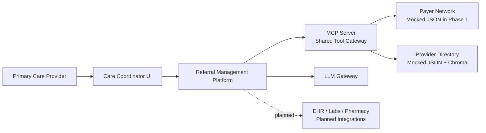
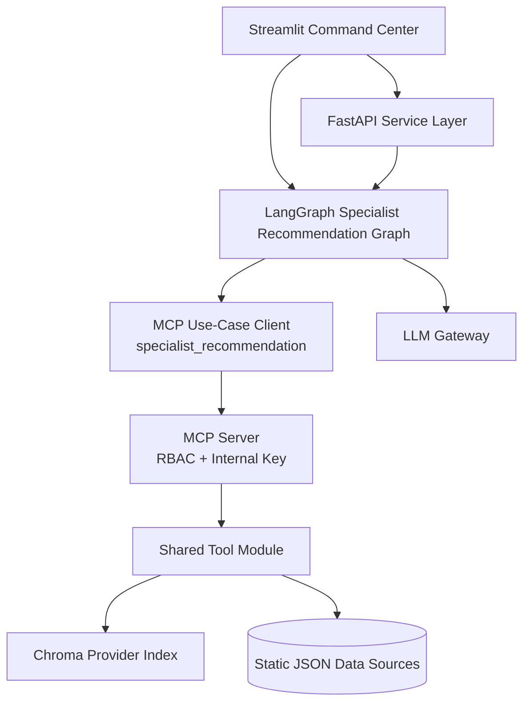
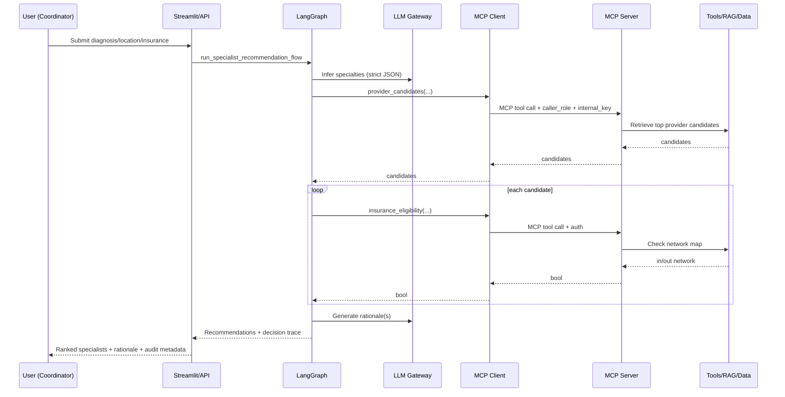

# Intelligent Care Coordination & Referral Management Platform

Detailed Architecture Document (Phase 1 implemented, Phase 2+ planned)

## 1. Executive Summary

This platform solves referral delays and poor care coordination by combining:
- Workflow orchestration using LangGraph
- MCP-governed tool access with caller-role RBAC
- Specialist recommendation using diagnosis + location + insurance network
- LLM-assisted specialty inference and rationale generation
- Explainable outputs with decision trace and human override support

Current implementation scope:
- AI Capability 1 completed: Recommend specialists based on diagnosis, location, and insurance network.

Expansion model:
- Future capabilities are added as independent use-case graph and client modules, reusing shared MCP server and tool contracts.

## 2. Problem Statement and Goals

Referral operations today are fragmented across PCPs, specialists, payers, and scheduling systems, causing:
- Long wait times
- Eligibility ambiguity
- Referral status opacity
- Manual coordination overhead

Primary goals:
- Streamline referral handoff and recommendation quality
- Improve explainability and auditability of AI-assisted decisions
- Enforce secure and governed AI-system integrations
- Preserve modular architecture for progressive capability rollout

## 3. Scope

In scope (Phase 1):
- Referral recommendation API
- MCP-integrated provider retrieval and insurance checks
- Streamlit command-center UX for operations users
- Unit and integration tests
- Dockerized run path

Out of scope (Phase 1):
- Production EHR/payer/scheduling live integrations
- Persistent event bus and enterprise observability stack
- Full patient-facing production app

## 4. Business Capability Map

Implemented now:
- Referral intake (structured and conversational)
- Clinical interpretation (diagnosis to specialist domains)
- Specialist recommendation and ranking
- Network eligibility verification
- Decision trace visibility and human override capture

Planned next capabilities (choose 3 more AI capabilities):
- Missing document detection before submission
- Referral history summarization for specialist pre-visit prep
- Delay prediction and escalation recommendations

Longer horizon:
- Automated appointment scheduling optimization
- Patient conversational status assistant

## 5. Stakeholders and Personas

- Care Coordinator: Drives referrals, monitors queues, resolves blockers.
- Primary Care Provider: Initiates referral with diagnosis context.
- Specialist Office Staff: Receives referral package and prioritizes intake.
- Payer Operations: Validates eligibility and plan constraints.
- Patient (future): Tracks progress and receives updates.

## 6. Context Diagram



## 7. High-Level Architecture



Design intent:
- Shared MCP server, use-case specific MCP clients
- Use-case specific graph modules
- Shared tool contracts for consistent system behavior

## 8. Runtime Sequence (Current Use Case)



## 9. Domain Decomposition (Target Microservices)

Suggested bounded contexts:
- referral-intake-service
- specialist-recommendation-service (implemented core logic now)
- eligibility-service
- scheduling-service
- notification-service
- clinical-document-service
- conversation-assistant-service
- analytics-and-operations-service

Each service can expose:
- REST APIs for command/query
- Event producers/consumers for asynchronous workflow steps

## 10. Stateful vs Stateless Design

Stateless:
- API request handlers
- LangGraph execution state per request
- MCP request handlers (runtime state)

Stateful:
- Chroma persisted vector index
- JSON data source files (phase-1 mock system of record)
- Future: event log, audit store, task queue, scheduling store

## 11. API Specifications (Implemented)

### 11.1 Health Endpoint
- Method: GET
- Path: /health
- Response:
  - status: ok

### 11.2 Recommendation Endpoint
- Method: POST
- Path: /api/v1/recommend-specialists

Request:
```json
{
  "patient_id": "PT-001",
  "diagnosis": "chest pain",
  "location": "Austin, TX",
  "insurance_plan": "Aetna",
  "max_results": 3
}
```

Response (current shape):
```json
{
  "request_id": "uuid",
  "generated_at": "2026-07-31T00:00:00+00:00",
  "inferred_specialties": ["Cardiology"],
  "recommendations": [
    {
      "provider_id": "P0001",
      "provider_name": "Dr Example",
      "specialty": "Cardiology",
      "location": "Austin, TX",
      "accepts_insurance": true,
      "next_available_date": "2026-08-03",
      "score": 0.92,
      "score_breakdown": {
        "specialty_component": 0.45,
        "location_component": 0.25,
        "insurance_component": 0.20,
        "wait_time_component": 0.02
      },
      "rationale": "High specialty and network fit with near-term availability."
    }
  ],
  "missing_information": [],
  "llm_used": true,
  "decision_trace": {
    "capability": "specialist_recommendation",
    "caller_role": "specialist_recommendation",
    "mcp_enabled": true,
    "tools_invoked": ["provider_candidates", "insurance_eligibility"],
    "human_review_required": false
  }
}
```

## 12. MCP Integration and Governance

MCP server responsibilities:
- Tool exposure
- Internal key validation
- Caller role RBAC enforcement

Current tool set:
- diagnosis_to_specialty
- provider_candidates
- insurance_eligibility

RBAC model:
- Role identifies use-case client context (example: specialist_recommendation)
- Role-to-tool mapping is enforced server-side before tool execution

Auth model:
- Internal shared key (MCP_INTERNAL_KEY)
- Key and caller role included in each MCP tool call payload

## 13. Key Non-Functional Requirements

Availability and reliability:
- API target availability: 99.5% for capstone staging
- Graceful dependency failure handling with explicit errors (LLM/MCP unavailable)

Performance:
- Recommendation response p95 target: < 2s on static mocked datasets
- Progressive UI rendering with live step status in Streamlit

Security and compliance:
- No secrets hardcoded in code
- Internal key-based MCP access control
- Minimized sensitive data exposure in logs

Auditability:
- Request ID, generated timestamp, decision trace, and override logs in UI

Scalability and maintainability:
- Stateless API layer allows horizontal scaling
- Use-case specific modules prevent cross-capability coupling

## 14. ADRs (Architecture Decision Records)

ADR-001: LangGraph Orchestration
- Status: Accepted
- Decision: Use explicit state graph for deterministic, testable workflow execution.
- Consequence: Better healthcare auditability than ad-hoc agent loops.

ADR-002: MCP as Integration Control Plane
- Status: Accepted
- Decision: Expose and consume external-system-like capabilities through MCP tools.
- Consequence: Strong governance and future multi-agent interoperability.

ADR-003: Role-Based Tool Authorization at MCP Layer
- Status: Accepted
- Decision: Enforce caller role and internal key at server entry for each tool.
- Consequence: Prevents unauthorized capability cross-access.

ADR-004: Static JSON + Chroma for Phase 1
- Status: Accepted
- Decision: Mock enterprise systems with JSON and local vector retrieval.
- Consequence: Fast and deterministic; realistic enough for capstone demos.

ADR-005: Use-Case Modularization
- Status: Accepted
- Decision: Separate use-case graph and client modules while sharing MCP server/tools.
- Consequence: Enables parallel team development for next AI capabilities.

## 15. Trade-Off Analysis

REST vs Events:
- Chosen now: REST for synchronous request-response simplicity.
- Future: Events for async lifecycle updates and escalations.

Orchestration vs Choreography:
- Chosen now: Orchestration for deterministic path and explainability.
- Future: Choreography for large-scale cross-service decoupling.

Stateful vs Stateless:
- Chosen now: Stateless request execution + minimal persisted indexing.
- Future: Explicit workflow state store for long-running referrals.

Single LLM calls vs multi-step reasoning:
- Chosen now: Focused strict JSON prompts for specific tasks.
- Future: Tool-augmented multi-agent reasoning for full referral lifecycle.

## 16. Event Catalog (Planned)

Proposed canonical events:
- ReferralSubmitted
- MissingDocumentDetected
- EligibilityCheckRequested
- EligibilityVerified
- SpecialistRecommended
- AppointmentProposed
- AppointmentConfirmed
- ReferralEscalated
- PatientNotified

Event flow intent:
- Command APIs generate authoritative state change events.
- Analytics and notifications consume events asynchronously.

## 17. Security Architecture

Current controls:
- MCP internal key validation
- Caller role authorization
- Controlled tool contracts

Next controls for production-grade implementation:
- OAuth2/OIDC for user and service identity
- mTLS between internal services
- Key rotation via secret manager
- Structured immutable audit logs
- PHI field-level encryption and tokenization

## 18. Deployment View

Current:
- Single Dockerized service for demo and evaluation

Target cloud-native:
- Kubernetes deployment
- API ingress with WAF
- Horizontal Pod Autoscaler for API and worker services
- Managed vector store and managed cache
- Centralized logging, metrics, tracing, and alerting

## 19. Testing Strategy and Evidence

Implemented:
- Unit tests for tools and authorization logic
- API integration tests for success and failure paths
- MCP failure path verification

Recommended additions:
- Contract tests for each MCP tool schema
- Synthetic load tests for p95 latency tracking
- Security tests for role/key misuse scenarios
- Golden test sets for recommendation quality drift

## 20. Human-in-the-Loop Design

Current:
- UI supports override reason capture and audit trail context

Planned:
- Explicit approval gates for low-confidence or high-risk referrals
- SLA-based escalation queue with coordinator ownership

## 21. AI Capability Expansion Plan (4 Capability Target)

Capability 1 (done):
- Specialist recommendation based on diagnosis, location, insurance

Capability 2 (next):
- Identify missing documents before referral submission

Capability 3:
- Summarize referral history for specialists before consultation

Capability 4:
- Predict referral delays and suggest escalation paths

Implementation rule:
- For each new capability, add:
  - dedicated graph module under app/agents
  - dedicated MCP client module under app/mcp_clients
  - optional new MCP tools under app/mcp_server/server.py + app/mcp_server/tools.py
  - tests without altering existing capability behavior

## 22. Current Repository Mapping

- app/main.py: API entrypoint
- app/agents/specialist_recommendation_graph.py: current use-case orchestration
- app/mcp_server/server.py: shared MCP server with RBAC
- app/mcp_server/tools.py: shared business/tool logic
- app/mcp_clients/specialist_recommendation_client.py: use-case client adapter
- app/rag/provider_index.py: Chroma retrieval
- streamlit_app.py: command-center UI
- tests/: unit/integration verification suite

## 23. Conclusion

The current solution establishes a strong architectural baseline for the capstone:
- Clear boundaries between orchestration, tools, and integration control plane
- AI-assisted recommendations with explainable outputs
- Governance via MCP RBAC and internal key controls
- Extensible module strategy to add remaining AI capabilities without disrupting existing functionality
