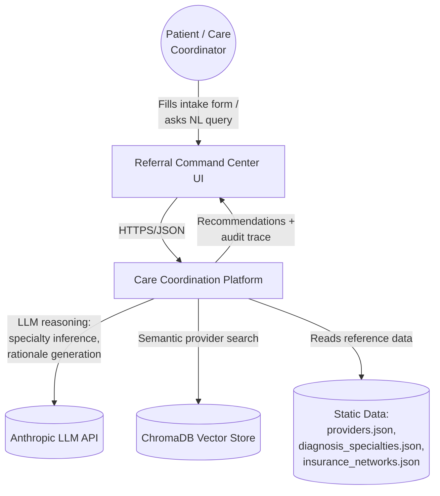
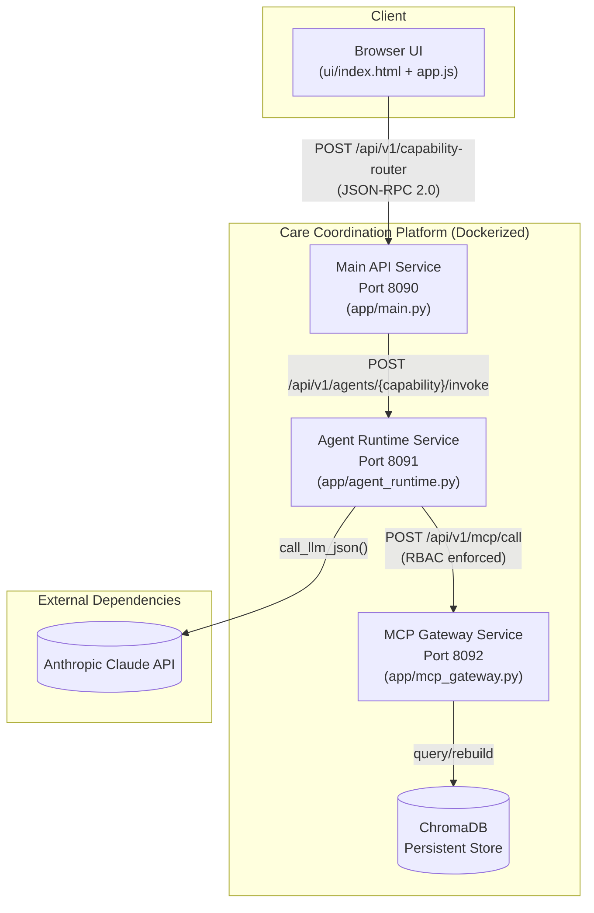
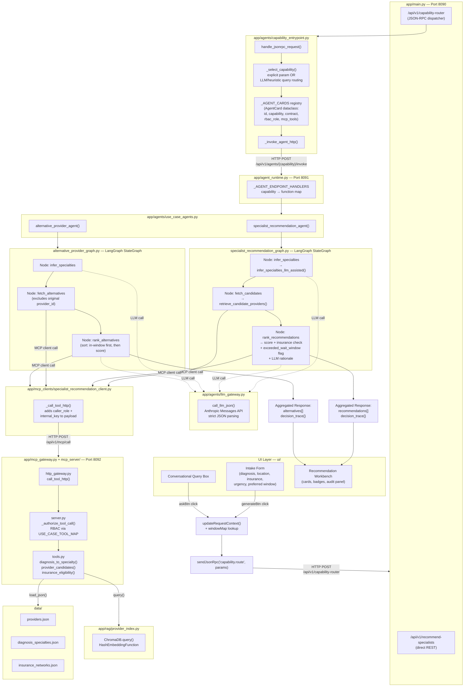
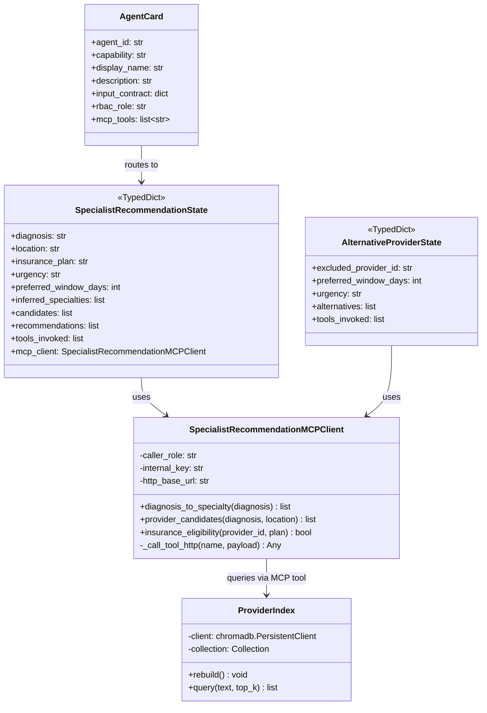
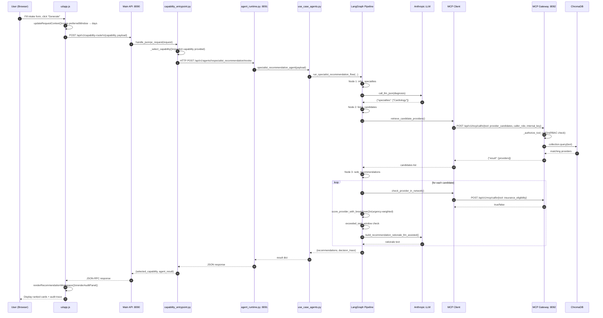
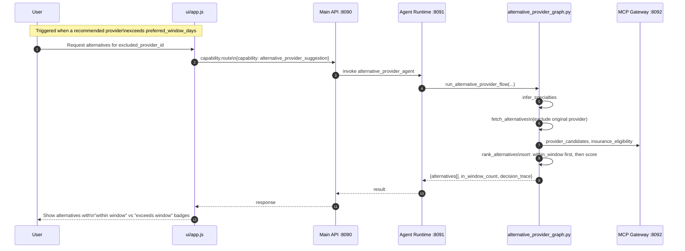
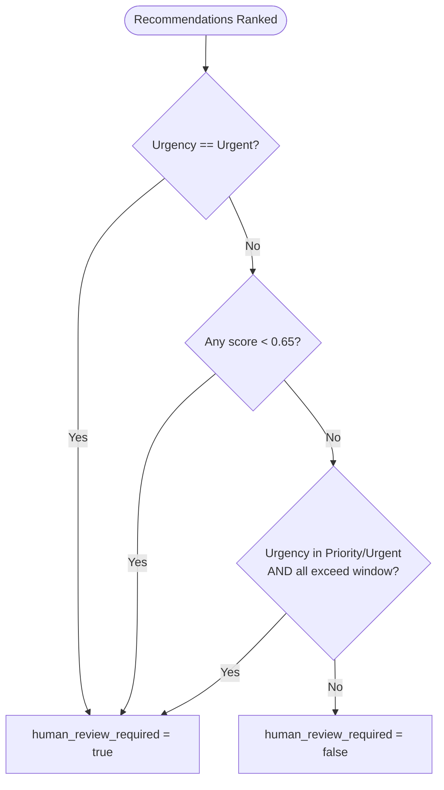
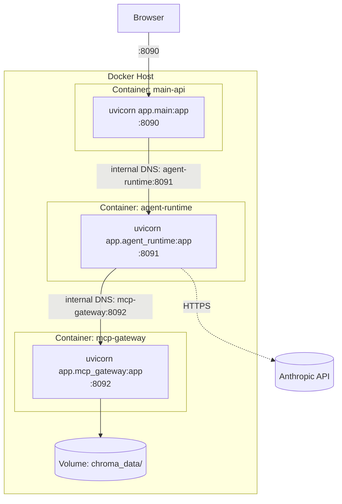

# Solution Architecture — Specialist Recommendation & Alternative Provider Suggestion

## Intelligent Care Coordination & Referral Management Platform

This document describes the complete solution architecture for the two implemented use cases:
1. **Recommend specialists based on diagnosis, location, and insurance network**
2. **Suggest alternative providers if appointments exceed target wait times**

---

## Table of Contents

1. [High-Level Design (HLD)](#1-high-level-design-hld)
2. [Low-Level Design (LLD)](#2-low-level-design-lld)
3. [End-to-End Sequence Diagram](#3-end-to-end-sequence-diagram)
4. [Component Responsibilities](#4-component-responsibilities)
5. [Data Model & Contracts](#5-data-model--contracts)
6. [Scoring Algorithm Detail](#6-scoring-algorithm-detail)
7. [Security & Governance](#7-security--governance)
8. [Deployment View](#8-deployment-view)

---

## 1. High-Level Design (HLD)

### 1.1 System Context Diagram



### 1.2 High-Level Component View



### 1.3 Business Capability Mapping

| Business Capability | Technical Component | AI Technique |
|---|---|---|
| Diagnosis-to-specialty mapping | `infer_specialties` node | LLM (Claude) with JSON-constrained output, validated against known specialty taxonomy |
| Provider discovery | `fetch_candidates` node | RAG (ChromaDB semantic search over hashed embeddings) |
| Insurance eligibility check | `check_provider_in_network` | Deterministic lookup (payer network JSON) |
| Multi-factor ranking | `score_provider_with_breakdown` | Weighted scoring, urgency-adaptive |
| Rationale generation | `build_recommendation_rationale_llm_assisted` | LLM natural-language generation |
| Alternative suggestion | `alternative_provider_graph.py` | Same pipeline, re-ranked with window filter |
| Governance / audit | `decision_trace` in every response | Rule-based escalation flags |

---

## 2. Low-Level Design (LLD)

### 2.1 Full Component & Data Flow Diagram



### 2.2 Class / Module Structure



---

## 3. End-to-End Sequence Diagram

### 3.1 Primary Flow: Specialist Recommendation



### 3.2 Secondary Flow: Alternative Provider Suggestion



---

## 4. Component Responsibilities

| Layer | File | Responsibility |
|---|---|---|
| **Presentation** | `ui/index.html`, `ui/app.js`, `ui/styles.css` | Intake form, chat box, recommendation workbench, audit/override panels |
| **API Gateway** | `app/main.py` | FastAPI app; exposes REST + JSON-RPC endpoints; serves static UI; CORS |
| **Capability Routing** | `app/agents/capability_entrypoint.py` | Agent card registry (self-describing capabilities); JSON-RPC 2.0 handler; HTTP forwarding to Agent Runtime |
| **Intent Inference** | `app/agents/capability_router.py` | LLM-based (`infer_query_with_llm`) + keyword heuristic fallback for free-text routing |
| **Agent Runtime** | `app/agent_runtime.py` | Standalone FastAPI service; dispatches `{capability}` to registered handler function |
| **Use-Case Agents** | `app/agents/use_case_agents.py` | Thin validation + adapter layer between HTTP payload and LangGraph flow functions |
| **Orchestration** | `app/agents/specialist_recommendation_graph.py`, `alternative_provider_graph.py` | LangGraph `StateGraph` — typed state, sequential nodes, deterministic edges |
| **LLM Gateway** | `app/agents/llm_gateway.py` | Wraps Anthropic Messages API; strict JSON extraction; env-driven config |
| **MCP Client** | `app/mcp_clients/specialist_recommendation_client.py` | Blocking HTTP client; injects `caller_role` + `internal_key`; raises `MCPClientError` |
| **MCP Gateway** | `app/mcp_gateway.py`, `app/mcp_server/http_gateway.py` | Single HTTP entrypoint `/api/v1/mcp/call`; delegates to `server.py` authorization + `tools.py` execution |
| **RBAC Enforcement** | `app/mcp_server/server.py` (`_authorize_tool_call`, `USE_CASE_TOOL_MAP`) | Validates `internal_key` secret + role-to-tool whitelist before any tool executes |
| **Tool Implementations** | `app/mcp_server/tools.py` | `map_diagnosis_to_specialties`, `retrieve_candidate_providers`, `check_provider_in_network`, `score_provider_with_breakdown`, rationale generators |
| **RAG Index** | `app/rag/provider_index.py`, `app/rag/embeddings.py` | ChromaDB persistent collection; rebuilt from `providers.json` at startup; hash-based embedding function (no external embedding API dependency) |
| **Static Data** | `data/*.json` | Mocked EHR/payer/provider-directory data acting as system-of-record stand-ins |

---

## 5. Data Model & Contracts

### 5.1 Request Contract — Specialist Recommendation

```json
{
  "jsonrpc": "2.0",
  "id": "req-001",
  "method": "capability.route",
  "params": {
    "capability": "specialist_recommendation",
    "payload": {
      "diagnosis": "chest pain",
      "location": "Austin, TX",
      "insurance_plan": "Aetna",
      "max_results": 5,
      "urgency": "Priority",
      "preferred_window_days": 7
    }
  }
}
```

### 5.2 Response Contract

```json
{
  "result": {
    "selected_capability": "specialist_recommendation",
    "selected_agent_card": { "agent_id": "agent.specialist_recommendation.v1", "...": "..." },
    "agent_transport": "http",
    "agent_result": {
      "request_id": "uuid",
      "generated_at": "2026-08-02T10:00:00Z",
      "inferred_specialties": ["Cardiology"],
      "recommendations": [
        {
          "provider_id": "P001",
          "provider_name": "Dr. Jane Doe",
          "specialty": "Cardiology",
          "location": "Austin, TX",
          "accepts_insurance": true,
          "next_available_date": "2026-08-05",
          "score": 0.87,
          "score_breakdown": {
            "specialty_component": 0.40,
            "location_component": 0.20,
            "insurance_component": 0.20,
            "wait_time_component": 0.17,
            "urgency": "Priority"
          },
          "rationale": "Specialty match, in-network, earliest availability.",
          "exceeded_wait_window": false
        }
      ],
      "missing_information": [],
      "llm_used": true,
      "decision_trace": {
        "capability": "specialist_recommendation",
        "caller_role": "specialist_recommendation",
        "mcp_enabled": true,
        "tools_invoked": ["provider_candidates", "insurance_eligibility"],
        "human_review_required": false
      }
    }
  }
}
```

### 5.3 MCP Tool Call Contract (internal)

```json
{
  "tool_name": "provider_candidates",
  "arguments": {
    "diagnosis": "chest pain",
    "location": "Austin, TX",
    "max_candidates": 12,
    "caller_role": "specialist_recommendation",
    "internal_key": "***"
  }
}
```

---

## 6. Scoring Algorithm Detail

### 6.1 Urgency-Adjusted Weight Table

| Urgency | Specialty Match | Location Match | Insurance Match | Wait-Time (max) | Wait Decay/day |
|---|---|---|---|---|---|
| Routine | 45% | 25% | 20% | 10% | 0.010 |
| Priority | 40% | 20% | 20% | 20% | 0.020 |
| Urgent | 35% | 15% | 15% | 35% | 0.035 |

**Formula:**

```
score = (w_specialty  if specialty matches      else 0)
      + (w_location   if location matches        else 0)
      + (w_insurance   if provider is in-network   else 0)
      + max(0, w_wait - d * decay)
```

where `d` = days until next available appointment, and the `w_*` / `decay` values come from the table above based on the case's urgency.

### 6.2 Human Review Escalation Rules



---

## 7. Security & Governance

| Control | Mechanism |
|---|---|
| **MCP Authentication** | Shared secret `MCP_INTERNAL_KEY` validated on every tool call in `_authorize_tool_call()` |
| **RBAC** | `USE_CASE_TOOL_MAP` — each `caller_role` whitelisted to specific tool names only |
| **Least Privilege** | `specialist_recommendation` role cannot invoke tools outside its declared `mcp_tools` list on its `AgentCard` |
| **Auditability** | Every response carries `decision_trace` (capability, role, tools invoked, escalation flag) |
| **Human-in-the-loop** | `human_review_required` flag surfaced in UI's Governance & Audit panel; override reason captured in `overrideLog` |
| **Secrets Management** | `.env` file (gitignored) holds `LLM_API_KEY`, `MCP_INTERNAL_KEY`; never hardcoded |
| **CORS** | Restricted to configured frontend origins in `app/main.py` |

---

## 8. Deployment View



All three containers run on the same Docker host and share the `chroma_data/` volume mounted into the `mcp-gateway` container.

**Environment variables required (per service, via `.env` or `docker compose env_file`):**
```
LLM_API_KEY, LLM_BASE_URL, LLM_MODEL
MCP_INTERNAL_KEY, MCP_TRANSPORT, MCP_HTTP_BASE_URL
AGENT_RUNTIME_BASE_URL
USE_MCP_TOOLS
```

> Inside Docker, `MCP_HTTP_BASE_URL` and `AGENT_RUNTIME_BASE_URL` must use **service names** (e.g. `http://mcp-gateway:8092`), not `127.0.0.1`.

---

## Summary

The solution follows a **3-tier microservice architecture** (Main API → Agent Runtime → MCP Gateway) with a **LangGraph-orchestrated agentic core** for reasoning, a **RAG layer** (ChromaDB) for semantic provider search, and an **LLM gateway** for diagnosis inference and natural-language rationale generation. Governance is enforced via **RBAC-gated MCP tool access** and every transaction produces an **auditable decision trace** with rule-based **human-in-the-loop escalation**.
